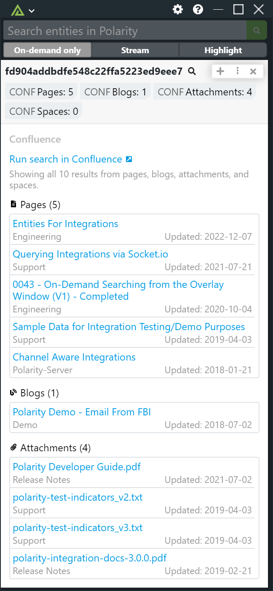

# Polarity Confluence Integration

The Polarity Confluence integration allows Polarity to search Confluence to return any Space, Attachment, Page or Blog that is contained in Confluence.



## Confluence Integration Options

### Confluence URL

Your Confluence Base Url to include the schema (i.e., https://) and port if required.

For example:

```
https://mycompany.atlassian.net/wiki
```

### Confluence Version

Select the version of Confluence you are authenticating to.

> The Confluence integration supports authenticating to Confluence Cloud as well as Confluence Server v7.9 and up

### Confluence Account Email

Your Confluence account email address (only required for Confluence Cloud).

### Confluence API Token

Your Confluence API token (required for both Confluence Server and Confluence Cloud).  

The Confluence API Token can be generated from a users profile page in Confluence.

https://id.atlassian.com/manage/api-tokens

### Space Keys

A comma delimited list of Confluence Space Keys to search.  If left blank, all spaces will be searched.

### Reduce Search Fuzziness

If checked, the integration will return fewer results with more of an exact string match on your entities.

### Search Titles Only

If checked, the integration will only search the title of pages

### Confluence Page Search

If checked, the integration will search keywords/phrases in Confluence pages

### Confluence Attachment Search

If checked, the integration will search keywords/phrases in Confluence attachments

### Confluence Blog Search

If checked, the integration will search keywords/phrases in Confluence blogs

### Confluence Space Search

If checked, the integration will return Confluence space names that contain the search term

> Note: At least one of the search options must be checked.

## Installation Instructions

Installation instructions for integrations are provided on the [PolarityIO GitHub Page](https://polarityio.github.io/).

## Polarity

Polarity is a memory-augmentation platform that improves and accelerates analyst decision making.  For more information about the Polarity platform please see:

https://polarity.io/
